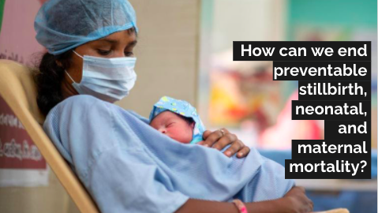

## Project summary
This is a **multiclass classification** project using **Cardiotocograph(CTG)** data to classify the fetal's wellbeing (Normal, Suspect, Pathological) in order to detect the risk of the fetal.
The main target in this project is to 
- Create models to identify the fetal's wellbeing
- Detect fetal's wellbeing in the risk group ('Suspect' or 'Pathological') by data visualization in Tableau.

For further information about this project and the results, please refer to the [presentation](https://docs.google.com/presentation/d/1a8GAKOVSXRye0OPvnsLM4sYUJHKMhU-R-i7Mjj1O4KE/edit#slide=id.p) or below.

## Background 
Did you know that having a healthy child is rather a miracle than 'normal'? 
Did you know that many pregnancies come with risk of death?
Many of us who lives in a developed world may have a beautiful picture of having a child but in the developing world there are many challenges lie in pregnancy and labor. Over 90% of fetal death and maternal death are happening in the developing world.

Based on the report from UNICEF open data source, it is estimated that **5.1 million** infant passed away before their fifth birthday. Out of the 5.1 million, **approx. 50% of death is happening within 4 weeks after birth (neonatal)**. 
And in addition, there are estimates of **2 million stillbirth (born dead)** every year which means that it occurs every 16 seconds. What is even more tragic is that the majority could have been prevented through quality care during pregnancy and at birth.

The world made remarkable progress in child survival in the past three decades. Since 2015, there is a new targets set out in the Sustainable Development Goals (SDGs) of ending preventable death of newborns and children under 5 years old.
Therefore it is essential to have a closer look into how to end preventable stillbirth and neonatal.

The mother's also comes with risk during pregnancy. In 2015, in anticipation of the launch of the SDGs, the World Health Organization (WHO) and partners released a consensus statement and full strategy paper on **ending preventable maternal mortality**. As of 2019 report from UNICEF open data source, there are approx. **300 thousand** maternal death worldwide and most are preventable.

So our key questions is *How can we end preventable stillbirth, neonatal and maternal mortality?*.

## Project goal and solution
Cardiotocograph(CTG) is the most widely used techniques in developed countries to monitor fetal heart rate and uterine contractions. The information of the CTG helps medical practitioners to evaluate the fetal's wellbeing (healthy or pathological) to prevent child and maternal mortality.
In this project, the target is to identify the fetal wellbeing from **modeling** and **data visualization**.
Ultimately apply these results and techniques in the developing world in order to help medical practitioners to take immediate actions to prevent fetal death and maternal death and achieve the target of SDGs by 2030.

## Data info
- Data set:  [Cardiotocography (CTG) data](https://www.kaggle.com/andrewmvd/fetal-health-classification) of fetal heart and uterine contractions from Kaggle
- Data set size: 2126 rows x 22 features
- Target variable: Fetal health status (Normal, Suspect, Pathological)
- Example of features: Baseline value (beats per minute), Uterine contractions per seconds, Severe decelerations, Histogram widths, max, min, mean 

## Results
### model
Three different models were tested in this studies: Logistic regression, KNN Classifier and Random Forest.
In this studies I am looking into high recall score to identify the best model since it is cruitial to correctly identify as many fetal in risk groups 'B' = suspect and 'C' = pathological.
Recall measure is used when we want to answer the question 'what proportion of actual Positives is correctly classified and it is calculated True Positive/(True Positive + False Positive). 
As the metrics to fix the imbalanced data, Upsampling and smote was applied.

Results: 
'A' = Normal, 'B' = Suspect, 'C' = Pathological
| Models               |                        |          | upsample              | smote          |
|----------------------|------------------------|----------|-----------------------|----------------|
| Logistic  regression | accurary score         |          | 0.7                   | 0.72           |
|                      | recall score           | A/ B/ C  | 0.72/0.61/0.71        | 0.67/0.69/0.68 |
| KNN Classifier       | accuracy score         |          | 0.81                  | 0.83           |
|                      | recall score           | A/ B/ C  | 0.78/0.90/0.95        | 0.84/0.89/0.93 |
| **Random Forest**    | **accuracy score**     |          | **0.91**                  | **0.91**           |
|                      | **recall score**       | A/ B/ C  | **0.93/0.80/0.89**    | **0.93/0.81/0.89** |

Based on the results above, Random Forest has the highest accuracy score of **0.91** and best balanced scores in recall.
Thus, upsampling and smote metrics with Random Forest performed best in this particular studies.
In this studies F1 score is not used since F1 score generates it's harmonized score by putting more weight on the lower score (in this case precision). As it is cruitial to identify the correct fetal wellbeing of 'B' and 'C', recall is the suitable measurement in this case.

### data visualization 
Please visit Python file for data viz with python, and  [Tableau public_yuawano](https://public.tableau.com/app/profile/yuri.awano) for Tableau.

## Next steps
Where CTG is distributed
- Provide the model and data visualization to hospitals, praxis so that the medical practitioners can apply the techniques in their daily check ups of their patients. This will help to identify fetal's wellbeing and take immediate actions if necessary.

The gap still lies on 'how can we apply this solution in countries where CTG is **not** distributed'.
Below are the next steps for countries there CTG is not distributed:
- Identify where CTG is not distributed
- Identify where trained practitioners are in lack
- Estimate the necessary investments and impact and allocate donations to maternal and fetal health

## Libraries
- [Pandas](https://pandas.pydata.org/)
- [Matplotlib](https://matplotlib.org/stable/contents.html)
- [Seaborn](https://seaborn.pydata.org/)
- [Sklearn](https://scikit-learn.org/stable/)

### Other data resource:
- [WHO maternal death report](https://www.who.int/news/item/05-10-2021-new-global-targets-to-prevent-maternal-deaths)
- [WHO Neonatal and perinatal mortality](http://apps.who.int/iris/bitstream/handle/10665/43444/9241563206_eng.pdf;jsessionid=F36359625C33C27CABCEBD4D451A7C46?sequence=1)
- [UNICEF press release 'One stillbirth occurs every 16 seconds](https://www.unicef.org/press-releases/one-stillbirth-occurs-every-16-seconds-according-first-ever-joint-un-estimates)
